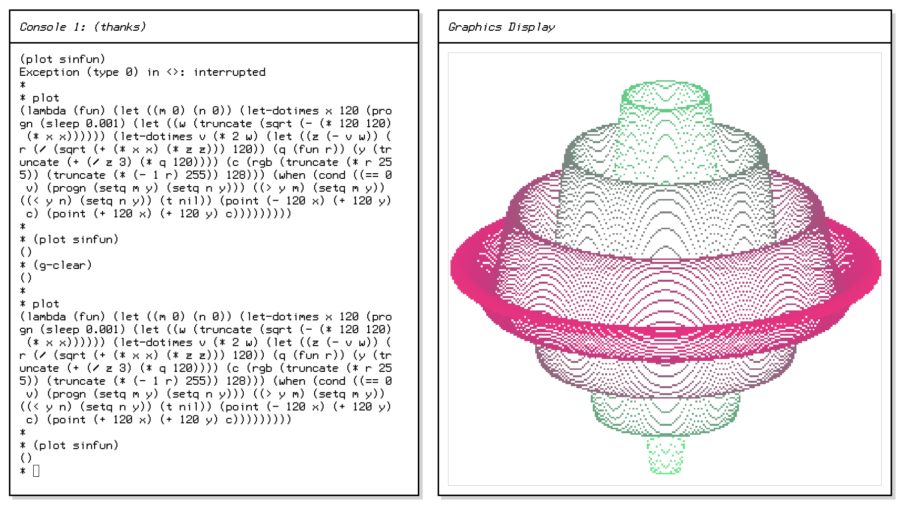

# thanks

It occurred to me that I'm Old and I've never implemented a Lisp before[^1]. How embarassing



Well, off to fix that. Two days - nay, four weeks - later and here is that Lisp. It's a mess (first time jitters) but yet:

* Working lambdas
* Garbage collection
* Tagbodies
* Lexical scoping
* Closures (it's a [MAN](https://en.wikipedia.org/wiki/Man_or_boy_test) baby)
* Macros
* Backquote forms
* Reader macros
* &optional and &rest lambda arguments
* File I/O
* Usually doesn't segfault

Thanks gets is name from "Thanksgiving" which was my original deadline. But, too much success! Had to push on.

---

## a reference

Thanks lisp is a Lisp-1 that implements ~~most~~ ~~some~~ a bit of the usual Lisp standard libraries. For instance, here's the Takeuchi function:
``` lisp
(def tak (lambda (x y z) 
  (if (not (< y x)) 
  z 
  (tak (tak (- x 1) y z) 
       (tak (- y 1) z x) 
       (tak (- z 1) x y)))))
```

And here's a curve plotter (in `examples/curve.lisp`):
``` lisp
(def plot (lambda (fun)
  (let ((m 0) (n 0))
    (progn (g-clear)
    (let-dotimes x 120 (progn
      (let ((w (truncate (sqrt (- (* 120 120) (* x x))))))
        (let-dotimes v (* 2 w)
          (let ((z (- v w))
                 (r (/ (sqrt (+ (* x x) (* z z))) 120))
                 (q (fun r))
                 (y (truncate (+ (/ z 3) (* q 120))))
                 (c (rgb (truncate (* r 255)) (truncate (* (- 1 r) 255)) 128)))
            (when
                (cond
                 ((== 0 v) (progn (setq m y) (setq n y)))
                 ((> y m) (setq m y))
                 ((< y n) (setq n y))
                 (t nil))
              (point (- 120 x) (+ 120 y) c) 
              (point (+ 120 x) (+ 120 y) c)))))))))))
```

An autogenerated reference is located [here](/reference.md). Most of these functions work like they would in Common Lisp[^2]. Some notes however:

* `(pyprint)` is a poor man's `(format)` - it prints all of its arguments on a single line, and doesn't print quotation marks around lone strings. (Like Python's `print` which accepts w/e)
 ```
* (pyprint '(1 2 3) "is a list with car" (car '(1 2 3)) "and cdr" (cdr '(1 2 3)))
(1 2 3) is a list with car 1 and cdr (2 3) 
 ```
* `([py]print-to)` expect a stream [from `(open)`] as their first arguments. `*error-stream*` returns a stream for... well.
* `(macro)` works like `(lambda)` except it generates a macro expression. ~~No backtick yet so have fun using it.~~
* You can load examples with `(load "filename")`. Most of them require the **graphics display** to be running.
* Other than byte arrays (e.g. strings), all the interpreter's data structures are built from cons cells. This lets you do fun things like `(map print (env-root))` which prints all definitions in the environment[^3].
* **All numbers are secretly doubles.**

---

## roadmap

I have no plans. Eventually I'd like to hack in integer support, so I can port my [pongo macro assembler](https://github.com/jclemme/pongo-vm) to the Web. Otherwise I'll keep adding library functions until I get bored, then I'll **throw it all away** and write a new version, with a JIT compiler.

---

[^1]: Actually I did once. It was written in Python and it used Python lists instead of conses to build Lisp lists. Let's pretend I didn't
[^2]: Read: strictly worse than they do in CL. 
[^3]: I don't know how rare this is, but it tickles me, so.
